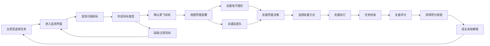

## 1. 产品概述

低空黑飞巡防模拟是一款城市空域管控主题的策略模拟游戏，玩家扮演城市空域值守员，通过多维度监测手段识别并处置违规无人机飞行，维护城市低空安全。

- **核心玩法**：多传感器监测 + 目标识别判读 + 地图战术部署 + 处置决策 + 复盘评分
- **目标用户**：策略游戏爱好者、模拟游戏玩家
- **产品价值**：沉浸式体验低空管控工作，提升公众对空域安全的认知

## 2. 核心功能

### 2.1 用户角色

| 角色 | 解锁方式 | 核心权限 |
|------|----------|----------|
| 值守员 | 初始角色 | 执行所有基础任务，使用基础传感器 |
| 高级值守员 | 累计积分解锁 | 解锁复杂天气、夜间模式 |
| 主管 | 高级别解锁 | 多目标同时追踪、高级传感器 |

### 2.2 功能模块

1. **主控室**：任务选择、区域选择、难度设置
2. **监测界面**：声纹图谱、雷达扫描、视频监控、信号强度四维监测
3. **判读系统**：目标分类识别（鸟群/合法航线/黑飞目标/设备噪声）
4. **地图界面**：电子围栏布设、风险路径标记、巡查队派遣
5. **处置界面**：喊话警告、持续跟踪、上报指挥、拦截处置、放行
6. **复盘界面**：误报率、响应时间、群众影响、证据完整度四维评分
7. **成长系统**：传感器解锁、天气系统、夜间视野、多目标入侵

### 2.3 页面详情

| 页面名称 | 模块名称 | 功能描述 |
|-----------|-------------|---------------------|
| 主控室 | 任务卡片列表 | 展示商业区、机场周边、赛事现场等任务区域，显示难度和奖励 |
| 主控室 | 值守员状态 | 显示等级、积分、已解锁装备 |
| 监测界面 | 声纹面板 | 实时波形显示，可调节频率范围，标记可疑信号 |
| 监测界面 | 雷达面板 | 圆形扫描雷达，显示目标方位和距离，有扫描动画 |
| 监测界面 | 视频面板 | 多路监控画面，可切换摄像头，放大查看 |
| 监测界面 | 信号面板 | 信号强度指示，频段分析，干扰检测 |
| 判读界面 | 目标卡片 | 展示目标特征，玩家选择目标类型 |
| 判读界面 | 特征比对 | 显示参考样本，辅助玩家判断 |
| 地图界面 | 城市地图 | 可拖拽缩放的城市地图，显示建筑和空域 |
| 地图界面 | 电子围栏 | 拖拽绘制多边形围栏，设置警戒级别 |
| 地图界面 | 巡查队 | 派遣巡查无人机到指定位置，显示状态 |
| 处置界面 | 处置选项 | 喊话、跟踪、上报、拦截、放行五种处置方式 |
| 处置界面 | 证据收集 | 自动记录监测数据作为处置证据 |
| 复盘界面 | 评分面板 | 四维评分雷达图，综合得分 |
| 复盘界面 | 事件回放 | 关键事件时间线，可点击查看详情 |
| 成长系统 | 技能树 | 传感器升级、能力解锁 |
| 成长系统 | 成就 | 达成条件解锁成就徽章 |

## 3. 核心流程

## 4. 用户界面设计

### 4.1 设计风格

- **主色调**：深邃藏青 (#0a1628) 作为背景主色，科技感蓝 (#00d4ff) 作为主强调色
- **辅助色**：警戒黄 (#ffc107)、危险红 (#ff4757)、安全绿 (#2ed573)、信息紫 (#a55eea)
- **整体风格**：赛博朋克科技风，深色主题，荧光发光效果， HUD 界面元素
- **字体**：Orbitron（标题/数字） + Roboto Mono（正文/数据），等宽字体增强科技感
- **按钮风格**：直角矩形，细边框，悬停发光效果，点击凹陷
- **图标风格**：线性图标，发光描边，科技感十足
- **动效**：扫描线动画、数据流动画、脉冲发光效果、故障艺术效果

### 4.2 页面设计概览

| 页面名称 | 模块名称 | UI元素 |
|-----------|-------------|-------------|
| 主控室 | 任务卡片 | 深色卡片，荧光边框，悬停发光放大，区域示意图 |
| 监测界面 | 四宫格面板 | 2x2 布局，每个面板有独立边框和标题栏，可点击放大 |
| 监测界面 | 雷达面板 | 圆形雷达，绿色扫描线，目标亮点，方位刻度 |
| 监测界面 | 声纹面板 | 波形图，频率刻度，峰值标记 |
| 判读界面 | 目标比对 | 左右分栏，左侧目标特征，右侧参考样本 |
| 地图界面 | 城市地图 | 深色地图底图，建筑轮廓，荧光色标记 |
| 地图界面 | 围栏绘制 | 拖拽顶点，半透明填充，边框发光 |
| 处置界面 | 操作面板 | 五个处置按钮呈扇形排列，不同颜色区分 |
| 复盘界面 | 评分雷达 | 四维雷达图，发光效果 |
| 成长系统 | 技能树 | 节点连线，解锁状态发光 |

### 4.3 响应式

- 桌面端优先设计，最低支持 1280x720 分辨率
- 游戏采用固定画布比例，确保界面元素布局一致
- 支持全屏模式，沉浸式游戏体验

### 4.4 动效设计

- 雷达扫描：圆形扫描线匀速旋转，目标出现时有脉冲扩散
- 声纹波动：波形实时滚动，异常频率高亮闪烁
- 信号强度：柱状图跳动，峰值保持
- 目标锁定：十字准星收缩锁定动画
- 围栏绘制：顶点拖拽时实时连线预览
- 页面切换：淡入淡出 + 缩放过渡
- 按钮悬停：边框发光增强，轻微上浮
