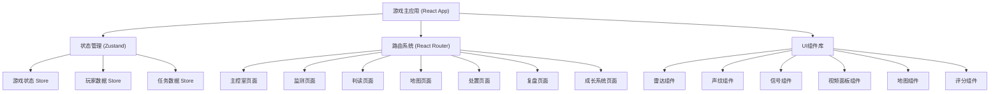
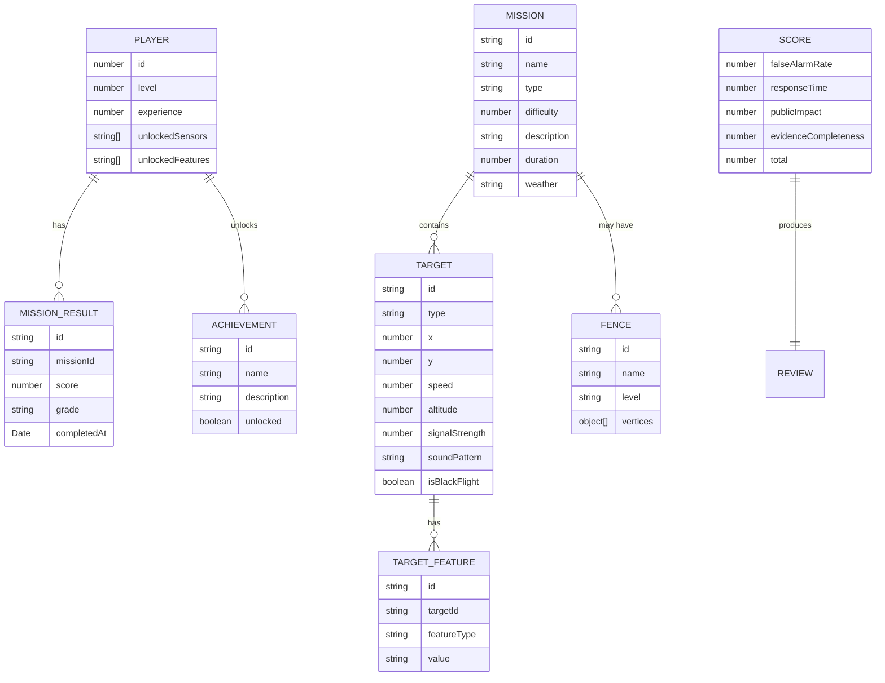

## 1. 架构设计



## 2. 技术描述

- **前端框架**: React@18 + TypeScript
- **构建工具**: Vite
- **样式方案**: Tailwind CSS 3
- **状态管理**: Zustand
- **路由管理**: React Router DOM
- **图标库**: Lucide React
- **图表/可视化**: 原生 Canvas API 实现雷达、声纹、信号可视化
- **动画**: CSS Animations + requestAnimationFrame
- **数据持久化**: localStorage 存储玩家进度

## 3. 路由定义

| 路由 | 页面 | 说明 |
|------|------|------|
| / | 主控室 | 任务选择、玩家状态展示 |
| /monitor | 监测界面 | 四维监测面板 |
| /identify | 判读界面 | 目标识别判读 |
| /map | 地图界面 | 电子围栏、巡查队部署 |
| /dispose | 处置界面 | 处置决策 |
| /review | 复盘界面 | 评分系统 |
| /growth | 成长系统 | 技能树、解锁 |

## 4. 状态管理设计

### 4.1 游戏状态 Store

```typescript
interface GameState {
  currentPhase: 'lobby' | 'monitor' | 'identify' | 'map' | 'dispose' | 'review';
  currentMission: Mission | null;
  detectedTargets: Target[];
  selectedTarget: Target | null;
  fences: Fence[];
  patrols: Patrol[];
  events: GameEvent[];
  startTime: number;
  score: Score;
}
```

### 4.2 玩家数据 Store

```typescript
interface PlayerState {
  level: number;
  experience: number;
  totalScore: number;
  unlockedSensors: string[];
  unlockedFeatures: string[];
  achievements: string[];
  missionHistory: MissionResult[];
}
```

## 5. 数据模型

### 5.1 数据模型定义



### 5.2 任务类型

| 类型 | 描述 | 难度 | 目标数量 |
|------|------|------|----------|
| 商业区 | 高楼密集，信号干扰多 | ★★☆ | 3-5 |
| 机场周边 | 禁飞区，管制严格 | ★★★ | 4-6 |
| 赛事现场 | 人员密集，影响大 | ★★★ | 5-8 |
| 工业园区 | 设备噪声干扰 | ★★☆ | 4-6 |
| 居民区 | 低空飞行多，情况复杂 | ★☆☆ | 2-4 |

### 5.3 目标类型

| 类型 | 声纹特征 | 雷达特征 | 信号特征 | 视频特征 |
|------|----------|----------|----------|----------|
| 黑飞无人机 | 高频电机声 | 稳定移动点 | 强遥控信号 | 小型飞行器 |
| 鸟群 | 不规则生物声 | 多个小目标聚集 | 无信号 | 鸟群形态 |
| 合法航线 | 规律发动机声 | 固定航迹 | 合法应答信号 | 大型飞机 |
| 设备噪声 | 固定频率噪声 | 无移动目标 | 电磁干扰 | 无目标 |

## 6. 项目结构

```
src/
├── components/          # 可复用组件
│   ├── monitor/        # 监测相关组件
│   │   ├── RadarPanel.tsx
│   │   ├── SonogramPanel.tsx
│   │   ├── SignalPanel.tsx
│   │   └── VideoPanel.tsx
│   ├── map/            # 地图相关组件
│   │   ├── CityMap.tsx
│   │   ├── FenceDrawer.tsx
│   │   └── PatrolUnit.tsx
│   ├── common/         # 通用组件
│   │   ├── GlowButton.tsx
│   │   ├── StatusBadge.tsx
│   │   └── HudPanel.tsx
│   └── review/         # 复盘相关组件
│       ├── ScoreRadar.tsx
│       └── EventTimeline.tsx
├── pages/              # 页面组件
│   ├── LobbyPage.tsx
│   ├── MonitorPage.tsx
│   ├── IdentifyPage.tsx
│   ├── MapPage.tsx
│   ├── DisposePage.tsx
│   ├── ReviewPage.tsx
│   └── GrowthPage.tsx
├── store/              # Zustand 状态管理
│   ├── useGameStore.ts
│   └── usePlayerStore.ts
├── data/               # 游戏数据
│   ├── missions.ts
│   ├── targets.ts
│   └── achievements.ts
├── utils/              # 工具函数
│   ├── gameLogic.ts
│   ├── scoring.ts
│   └── canvasHelpers.ts
├── types/              # TypeScript 类型
│   ├── game.ts
│   ├── mission.ts
│   └── player.ts
├── App.tsx
├── main.tsx
└── index.css
```

## 7. 核心游戏循环

1. **监测阶段**：使用 Canvas 动画模拟实时监测数据，随机生成目标信号
2. **判读阶段**：玩家根据四维度数据判断目标类型，限时答题增加紧张感
3. **部署阶段**：在 SVG/Canvas 地图上拖拽绘制电子围栏，派遣巡查队
4. **处置阶段**：根据目标类型和位置选择合适的处置方式
5. **复盘阶段**：计算四维评分，生成任务报告，发放奖励

## 8. 性能优化

- 使用 Canvas 绘制高频动画（雷达、声纹），避免 DOM 重绘
- 游戏状态更新使用 requestAnimationFrame 节流
- 组件合理拆分，避免不必要的重渲染
- 使用 useMemo/useCallback 优化计算和回调
- 静态资源预加载
